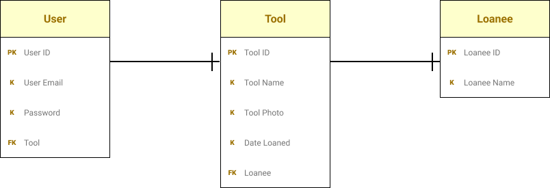

# Tool Loaner

You know all the times that you loan out a tool and forgot that you loaned it out, that you might as well have gifted it? Be generous no more with Tool Loaner. Where you can track what you loaned out and who you loaned it to, so that one day you get it back.

To this day, I do not remember if I loaned out my cat claw or misplaced it.

## Planning

Entity Relationship Diagram:

## API

### Versions

- /api/v1
- /api/v2
  - updated controller to allow image upload to cloudinary and save returned url to database.

#### Users

User Routes:

- GET /users
- POST /users
- DELETE /users/:id
- SIGNIN /users/signin

#### Tools

Tool Routes

- GET /tools
- POST /tools
- PATCH /tools/:id
- DELETE /tools/:id

### Fixes

- [x] Fixed the upload limit to 10mb. Nginx was limiting the upload size to 1mb.
